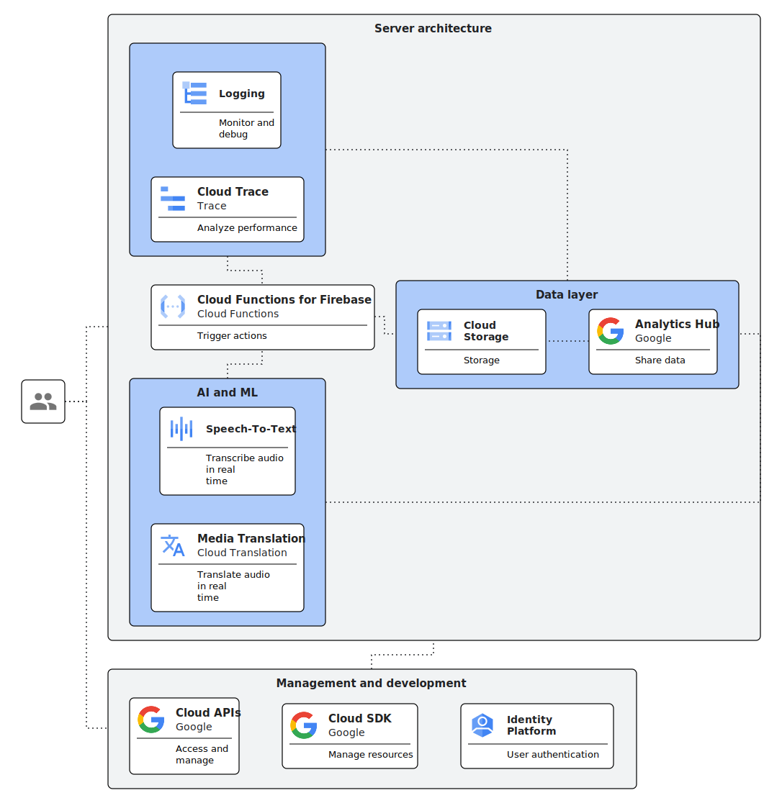

# Sermon-Translator

## Design

## Implementation
1. Set up Speech-to-Text: Configure the Speech-to-Text API to transcribe the audio stream in real time. This involves selecting the appropriate language model and setting up the streaming recognition configuration.
2. Integrate Media Translation: Integrate the Media Translation API with the Speech-to-Text API to translate the transcribed text into the desired target language. This involves specifying the source and target languages and selecting the appropriate translation model.
3. Utilize Cloud Functions for Firebase: Use Cloud Functions for Firebase to handle the real-time processing of the audio stream. This allows you to trigger the Speech-to-Text and Media Translation APIs on demand, ensuring a seamless and efficient workflow.
4. Display in frontend: Use HuggingFace Spaces to host and display as a Streamlit app.
